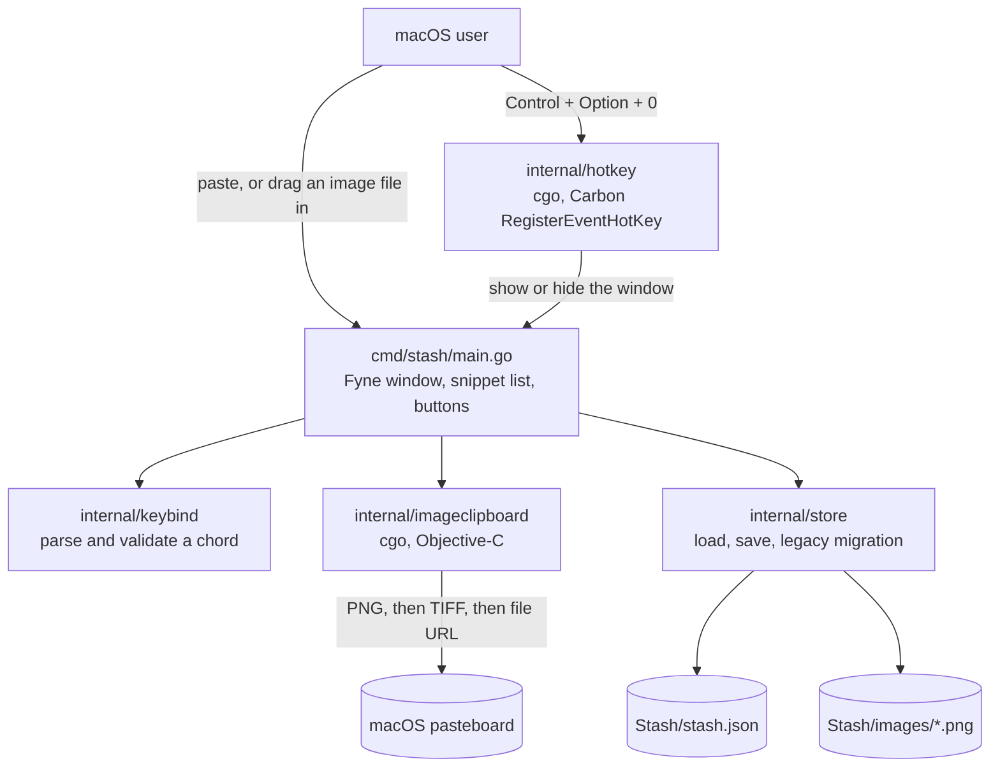

# Stash

A small macOS app that keeps the text and images you want to copy again later, one global shortcut away.


## What it does

The clipboard holds one thing. Stash holds the last however-many things you decided were worth keeping.

Paste text or an image into the window, or drag an image file onto it, and it's saved. Click Copy on any entry to put it back on the clipboard, Delete to drop one, Clear All to empty the list.
`Control + Option + 0` hides and brings back the window from anywhere, and you can rebind it to any key plus at least one modifier by clicking the shortcut button.

That is the whole app, and the list is short on purpose. Everything is stored locally in one JSON file with saved images as PNGs beside it, so there's no account, no sync, and nothing leaves the machine.

The interesting part of the repo isn't the feature list, it's that this is the third version of the same idea. It was QuickDraft, then QuickNote in C++ and Qt, and it's now Go. Most of what follows is what that taught me about shipping a macOS app rather than about snippets.

## Tech stack

| Layer | What it uses |
| --- | --- |
| Language | Go 1.23 |
| UI | Fyne v2, with a custom theme in `cmd/stash/theme.go` |
| Global shortcut | Carbon `RegisterEventHotKey` through cgo |
| Image clipboard | AppKit `NSPasteboard` through cgo, in Objective-C |
| Persistence | One JSON file under `os.UserConfigDir()`, PNGs in an `images/` directory beside it |
| Packaging | `scripts/package-macos.sh`: `.app` bundle, `.icns` via `sips` and `iconutil`, ad-hoc codesign, zip |
| CI | GitHub Actions on `macos-latest`, builds, tests, and packages on every push |

One direct dependency. About 1,500 lines of Go including tests.

## Architecture



There is no server, no background daemon, and no second process. `main.go` builds the window and holds the only state, `internal/store` is the only thing that touches the disk, and the two cgo packages are the only things that touch macOS APIs.

A paste goes to `internal/imageclipboard` first to see whether the pasteboard holds an image; if it does, the bytes are written into `images/` and the entry records the filename, and if it doesn't, the text is stored inline in the JSON. Loading works backwards through the same file, and falls back to two older paths and an older schema before deciding a first run is genuinely a first run.
Both platform-specific packages have a `//go:build !darwin` stub next to them, so `go build ./...` and `go vet ./...` still work on a Linux machine even though the app itself doesn't.

## What building this taught me

**Rewriting in Go was cheaper than fixing Qt's distribution story.** The packaged Qt build worked on my machine and broke after install elsewhere. `scripts/package-macos.sh` had grown `install_name_tool` rewrites for each bundled plugin, and it turned out the app binary itself was never rewritten, so the bundle loaded one copy of Qt from inside itself and another from Homebrew. Fixing it properly meant rewriting three frameworks against three possible source paths, because Homebrew splits `qt` and `qtbase` into separate kegs with different prefixes. The Go binary links what it needs statically and the packaging script went back to being a plist and an icon. A GUI framework's distribution model is a feature you're picking, not an implementation detail you deal with later.

**`fn` as a hotkey modifier costs you an Accessibility permission.** The original default was `fn + 0`, which sounds harmless and isn't: Carbon's `RegisterEventHotKey` can't see `fn`, so catching it means installing an event tap, which means macOS prompts for Accessibility access and silently does nothing until the user grants it in System Settings. `Control + Option + 0` registers through the ordinary API and needs no permission at all. Changing the default meant migrating existing configs off `fn + 0`, since the people most affected already had the broken one saved.

**Hide-on-close plus a hide/show hotkey leaves no way to quit.** `SetCloseIntercept` hid the window instead of closing it, which is the right behaviour for a menu-bar app and the wrong behaviour for an app with no menu-bar item. There was no visible way out of the process. Removing the intercept means the red button quits and the shortcut toggles, which are two different intentions and now do two different things.

**The clipboard doesn't have "an image type", it has several.** `internal/imageclipboard` asks for `NSPasteboardTypePNG`, falls back to `NSPasteboardTypeTIFF` and converts it, and falls back again to reading file URLs. macOS screenshots arrive as TIFF, so without the second branch the most common way anyone would ever put an image on the clipboard produced nothing. This lives in a `.m` file because Go's clipboard handling is text-only, and it's the one place in the repo where the platform decided the language.

**Renaming an app twice means two legacy read paths and a legacy schema.** `legacyPaths` looks for `QuickDraft/quickdraft.json` and `QuickNote/quicknote.json` before giving up, and the old format's `clips` array is decoded separately and converted to the current `snippets`. The directory name and the file format changed at different times for different reasons, so they get handled separately rather than as one "old version" case. The alternative is an upgrade that quietly starts you with an empty list, which looks exactly like data loss whether or not it technically is.

## Quick start

Needs macOS 11 or later. Download `Stash-macOS.zip` from the [latest release](https://github.com/JustinK33/Stash/releases/latest), unzip it, and move `Stash.app` to Applications.
The build is ad-hoc signed and not notarized, so macOS quarantines it on first open:

```bash
xattr -dr com.apple.quarantine /Applications/Stash.app
open /Applications/Stash.app
```

From source, on macOS with the Xcode command line tools installed for cgo:

```bash
bash scripts/package-macos.sh
open build/Stash.app
```

That builds the binary, writes the plist, generates the icon, signs the bundle, and zips it. `bash scripts/install-macos.sh` does the same and installs into `~/Applications`.

```bash
go test ./...
```

The store tests cover the legacy migration paths, which is the part most likely to break silently.
