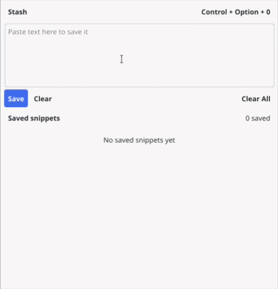
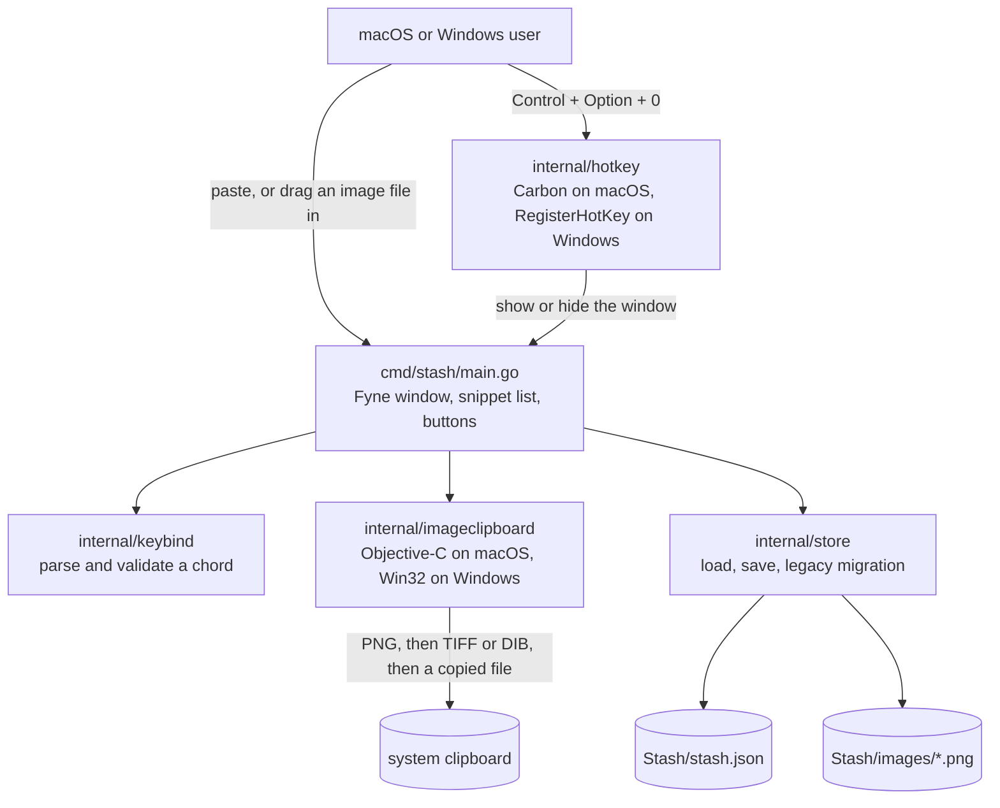

# Stash

A small macOS and Windows app that keeps the text and images you want to copy again later, one global shortcut away.



## What it does

The clipboard holds one thing. Stash holds the last however-many things you decided were worth keeping.

Paste text or an image into the window, or drag an image file onto it, and it's saved. Click Copy on any entry to put it back on the clipboard, Delete to drop one, Clear All to empty the list.
`Control + Option + 0` (`Ctrl + Alt + 0` on Windows) hides and brings back the window from anywhere, and you can rebind it to any key plus at least one modifier by clicking the shortcut button.

That is the whole app, and the list is short on purpose. Everything is stored locally in one JSON file with saved images as PNGs beside it, so there's no account, no sync, and nothing leaves the machine.

The interesting part of the repo isn't the feature list, it's that this is the third version of the same idea. It was QuickDraft, then QuickNote in C++ and Qt, and it's now Go. Most of what follows is what that taught me about shipping a macOS app rather than about snippets.

## Tech stack

| Layer | What it uses |
| --- | --- |
| Language | Go 1.23 |
| UI | Fyne v2, with a custom theme in `cmd/stash/theme.go` |
| Global shortcut | Carbon `RegisterEventHotKey` through cgo on macOS, Win32 `RegisterHotKey` through `syscall` on Windows |
| Image clipboard | AppKit `NSPasteboard` through cgo, in Objective-C, on macOS; Win32 clipboard with PNG and DIB formats on Windows |
| Persistence | One JSON file under `os.UserConfigDir()`, PNGs in an `images/` directory beside it |
| Packaging | `scripts/package-macos.sh`: `.app` bundle, `.icns` via `sips` and `iconutil`, ad-hoc codesign, zip; `scripts/package-windows.ps1`: `fyne package` exe with embedded icon, zip |
| CI | GitHub Actions on `macos-latest` and `windows-latest`, builds, tests, and packages on every push |

One direct dependency. About 1,500 lines of Go including tests.

## Architecture



There is no server, no background daemon, and no second process. `main.go` builds the window and holds the only state, `internal/store` is the only thing that touches the disk, and the two platform packages are the only things that touch macOS or Windows APIs.

A paste goes to `internal/imageclipboard` first to see whether the pasteboard holds an image; if it does, the bytes are written into `images/` and the entry records the filename, and if it doesn't, the text is stored inline in the JSON. Loading works backwards through the same file, and falls back to two older paths and an older schema before deciding a first run is genuinely a first run.
Both platform-specific packages have a `_windows.go` file in pure Go that calls `user32` and `kernel32` through `syscall`, so the Windows build needs no extra C code.
They also have a `//go:build !darwin && !windows` stub, so `go build ./...` and `go vet ./...` still work on a Linux machine even though the app itself doesn't.

## What building this taught me

**Rewriting in Go was cheaper than fixing Qt's distribution story.**
The packaged Qt build worked on my machine and broke after install elsewhere, because the packaging script rewrote every bundled plugin's library paths and never the app binary, so the bundle loaded one copy of Qt from inside itself and another from Homebrew.
A GUI framework's distribution model is a feature you are picking, not an implementation detail you deal with later.

**`fn` as a hotkey modifier costs you an Accessibility permission.**
Carbon's `RegisterEventHotKey` cannot see `fn`, so the `fn + 0` default needed an event tap, which means macOS prompts for Accessibility access and silently does nothing until it is granted.
`Control + Option + 0` registers through the ordinary API and needs no permission, and changing the default meant migrating the configs of the people already stuck on the broken one.

**The clipboard doesn't have "an image type", it has several.**
`internal/imageclipboard` asks for PNG, falls back to TIFF and converts, and falls back again to file URLs, because macOS screenshots arrive as TIFF and without that second branch the most common way anyone puts an image on the clipboard produced nothing.
It lives in a `.m` file since Go's clipboard handling is text-only, the one place in the repo where the platform picked the language.

## Quick start

### macOS

Needs macOS 11 or later. Download `Stash-macOS.zip` from the [latest release](https://github.com/JustinK33/Stash/releases/latest), unzip it, and move `Stash.app` to Applications.
The build is ad-hoc signed and not notarized, so macOS quarantines it on first open:

```bash
xattr -dr com.apple.quarantine /Applications/Stash.app
open /Applications/Stash.app
```

From source, on macOS with the Xcode command line tools installed for cgo:

```bash
bash scripts/package-macos.sh
open build/Stash.app
```

That builds the binary, writes the plist, generates the icon, signs the bundle, and zips it. `bash scripts/install-macos.sh` does the same and installs into `~/Applications`.

### Windows

Needs Windows 10 or later.
Download `Stash-Windows.zip` from the [latest release](https://github.com/JustinK33/Stash/releases/latest).
The exe is not code signed, so Windows marks the download as coming from the internet and SmartScreen blocks it on first launch.
Unblock the zip before extracting it and Windows never asks:

```powershell
Unblock-File "$env:USERPROFILE\Downloads\Stash-Windows.zip"
Expand-Archive "$env:USERPROFILE\Downloads\Stash-Windows.zip" "$env:LOCALAPPDATA\Programs\Stash"
& "$env:LOCALAPPDATA\Programs\Stash\Stash.exe"
```

Without PowerShell, right-click the zip, choose Properties, tick Unblock, then extract it.
If you already hit the "Windows protected your PC" screen, click More info and then Run anyway.
When the window is hidden, the tray icon brings it back.

From source, with Go and a MinGW-w64 `gcc` on `PATH` for cgo:

```powershell
./scripts/package-windows.ps1
```

```bash
go test ./...
```

The store tests cover the legacy migration paths, which is the part most likely to break silently.
